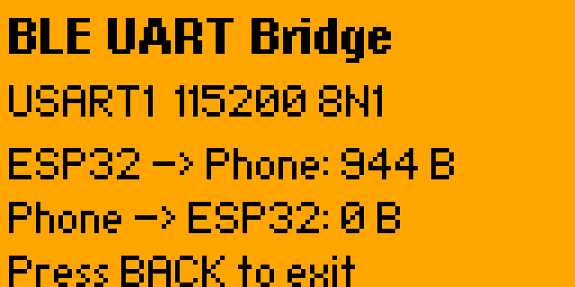

# Zero Bluetooth Bridge



Remote management of Flipper Zero over Bluetooth. This app bridges BLE serial to GPIO UART, letting you wirelessly control serial devices connected to Flipper — ESP32 Marauder, GPS modules, and other UART peripherals — directly from your phone.

The built-in "GPIO → UART Bridge" only bridges **USB ↔ UART**, requiring a cable. This app bridges **BLE ↔ UART** instead, giving you wireless access. More transports are planned.

## What it does

- Switches Flipper BLE to serial profile (phone can connect)
- Opens USART1 at 115200 baud (GPIO pins 13 TX / 14 RX)
- Forwards all data bidirectionally: phone ↔ UART device
- Shows live byte counters on screen

## Install

### From release

Download `bluetooth_bridge.fap` from [Releases](https://github.com/excitoon/zero-bluetooth-bridge/releases) and copy to `apps/Bluetooth/` on your Flipper's SD card.

### From source

```bash
pip install ufbt
git clone https://github.com/excitoon/zero-bluetooth-bridge.git
cd zero-bluetooth-bridge
ufbt build
```

The built FAP is at `dist/bluetooth_bridge.fap`.

### Deploy via USB

```bash
ufbt launch  # builds, installs, and launches on connected Flipper
```

### Deploy via BLE

Use [zero-updater](https://github.com/excitoon/zero-updater) to upload and launch over Bluetooth:

```bash
pip install git+https://github.com/excitoon/zero-updater.git
zero-updater upload dist/bluetooth_bridge.fap /ext/apps/Bluetooth/bluetooth_bridge.fap --launch
```

## Usage

1. Connect a serial device to Flipper's GPIO (e.g., ESP32 WiFi module)
2. On Flipper: launch **BLE UART Bridge** (Apps → Bluetooth)
3. From your phone: connect to the Flipper via BLE
4. Send/receive serial data over BLE

### First-time pairing

The first BLE connection requires entering a pairing code shown on the Flipper screen. This pairing is stored permanently — no re-pairing needed after reboots.

## Compatibility

- **Flipper Zero** with official firmware 1.x
- **Any BLE serial terminal app** on iOS/Android
- **Any UART device** at 115200 8N1

Tested with:
- ESP32 Marauder
- Flipper WiFi Dev Board (ESP32-S2)

## TODO

- Flipper emulator support for CI screenshots and automated testing

## Building

Requires [ufbt](https://pypi.org/project/ufbt/) (micro Flipper Build Tool):

```bash
pip install ufbt
ufbt build
```

## License

MIT
